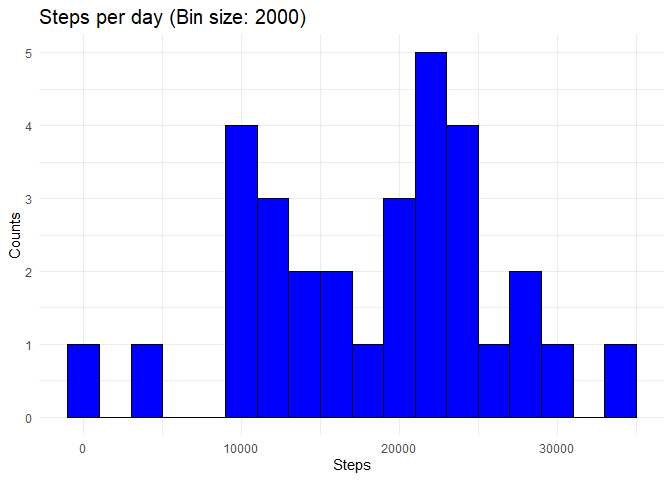

### Loading and preprocessing the data
Load data "Activity Monotorting Data" of the file "activity.zip". The variables includes in this dataset are:

* steps: Number of steps taking in a 5-minute interval

* date: The date on which the measurement was taken in YYYY-MM-DD format

* interval:: Identifier for the 5-minute interval in which measurement was taken

The dataset is stored in a comma-separated-value (CSV) file and there are a total of 17,568 observations in this dataset. Unzip file, for extract file "csv"

```r
unzip ("activity.zip")
```
Load the data with function "read.csv()", these are stored in variable *data*,  convert data in row "date" into Date


```r
data      <- read.csv(file = "activity.csv", sep = ",", header = TRUE, 
                      colClasses = c("numeric", "character", "numeric"))
data$date <- as.Date(data$date,format = "%Y-%M-%d")
```
Print data

```r
str(data)
```

```
## 'data.frame':	17568 obs. of  3 variables:
##  $ steps   : num  NA NA NA NA NA NA NA NA NA NA ...
##  $ date    : Date, format: "2012-12-01" "2012-12-01" ...
##  $ interval: num  0 5 10 15 20 25 30 35 40 45 ...
```
### What is mean total number of steps taken per day?

We generate a data.frame with the sum of steps for each date.


```r
steps_day <- tapply(data$steps, data$date, sum,na.rm =TRUE,simplify =  FALSE)
steps_day <- data.frame(matrix(unlist(steps_day),
                                   nrow=length(steps_day), byrow=T))

names(steps_day) <- "steps"
steps_day$date   <- unique(data$date)
```
Print steps_day 

```r
head(steps_day)
```

```
##   steps       date
## 1     0 2012-12-01
## 2 10726 2012-12-02
## 3 21923 2012-12-03
## 4 12116 2012-12-04
## 5 23733 2012-12-05
## 6 23754 2012-12-06
```
1. Histogram of the total number of steps taken each day, we will load the library ggplot2


```r
library(ggplot2)
ggplot(steps_day, aes(x=steps)) + 
        geom_histogram(binwidth = 2000,color="black", fill="blue")+
        ggtitle("Steps per day (Bin size: 2000)") +
        labs(x = "Steps", y = "Counts")+
        theme_minimal() +
        theme(
           plot.title = element_text(size=15)
        )
```

<!-- -->


### What is the average daily activity pattern?


### Imputing missing values


### Are there differences in activity patterns between weekdays and weekends?
